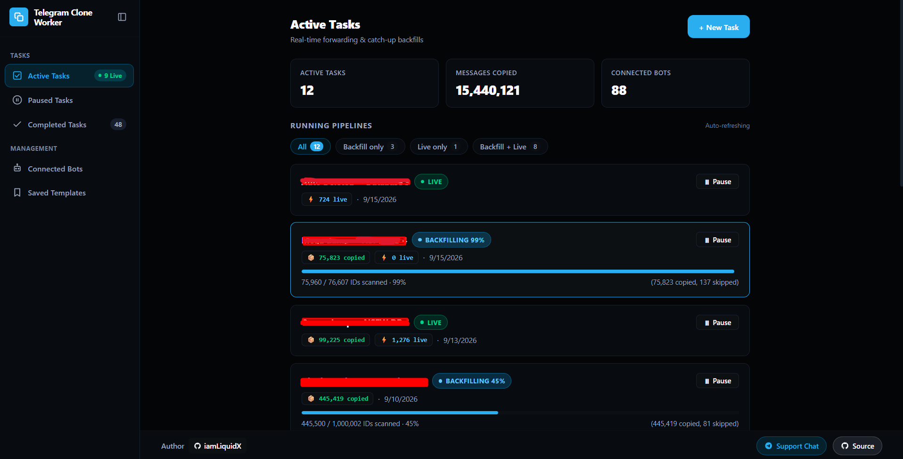
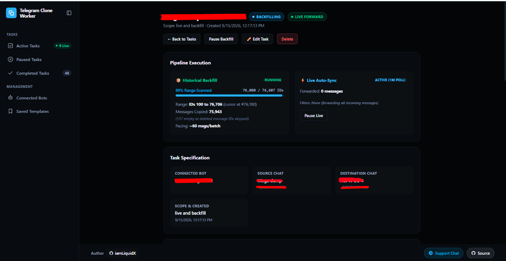
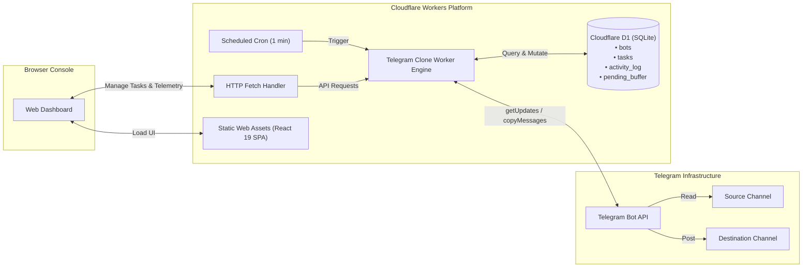

# Telegram Clone Worker

<p align="center">
  
  
  
  
  
</p>

<p align="center">
  <strong>Fast, serverless Telegram channel cloner, batch backfiller, and real-time live synchronization engine.</strong><br />
  Runs natively on <strong>Cloudflare Workers</strong>, <strong>Cloudflare D1 (Serverless SQLite)</strong>, and the <strong>Telegram Bot API</strong>.
</p>

<p align="center">
  <a href="https://deploy.workers.cloudflare.com/?url=https://github.com/iamLiquidX/telegram-clone-worker">
    
  </a>
</p>

---

## Overview

**Telegram Clone Worker** is a self-hosted, cloud-native Telegram management engine and web console designed to replicate message history between Telegram channels and groups at maximum speed, while staying completely within Telegram's rate limits and Cloudflare's free-tier boundaries.

Whether you need to migrate an archive of 100,000+ historical media files, maintain a real-time live mirror of an active broadcast channel, or selectively forward specific media types (videos, documents, audio) above a certain file size threshold, Telegram Clone Worker handles it all automatically in the background.

---

## Screenshots

<p align="center">
  
</p>
<p align="center"><em>Real-time dashboard tracking active pipelines, messages copied counter, and multi-bot metrics.</em></p>

<br />

<p align="center">
  
</p>
<p align="center"><em>Granular task view showing backfill progress, live auto-sync polling status, and channel bindings.</em></p>

---

## Key Features

### 🚀 High-Throughput Backfill Engine
- **Sequential Range Backfill**: Clone full history between exact message IDs (`start_id` to `end_id`) with configurable pacing batch sizes (default: 60 messages/minute).
- **"Last N" Recent Backfill**: Fast backward-scanning discovery to clone the latest *N* messages without needing to guess channel start IDs.
- **Resilient Gap Handling**: Deleted posts or empty message IDs in Telegram channels are skipped cleanly without stalling the pipeline or throwing false failures.

### ⚡ 1-Minute Live Stream Auto-Sync
- **Cron-Driven Polling**: Automatically checks Telegram updates every minute across all active bots with multi-page update draining (up to 500 updates per tick).
- **Two-Stage Catch-Up Stream**: Buffers incoming live messages while an initial history backfill is active, and automatically drains the buffer in sequential order once the backfill finishes.

### 🔍 Granular Message & Size Filtering
- **Media Type Filtering**: Choose to copy all messages or restrict to specific media types (`document`, `video`, `photo`, `audio`).
- **File Size Thresholds**: Filter media by file size (e.g. only copy files `≥ 10 MB` or ignore files `> 500 MB`).
- **Live Filter Telemetry**: See real-time skip and match logs directly in your activity feed.

### 🛡️ Enterprise Multi-Bot Scaling & Rate Limit Protection
- **Concurrency Limiter**: Multi-bot polling strictly adheres to Cloudflare Workers' 6-connection ceiling, preventing silent socket stalls.
- **Atomic Bot Leases**: Bot-scoped locks guarantee tasks on the same bot never collide or flood Telegram with parallel batches.
- **Automatic 429 Cooldown**: Catches Telegram rate limits (`retry_after`), pauses the specific bot, and automatically resumes once the cooldown expires.
- **401 & 409 Self-Healing**:
  - Automatically detects revoked tokens (401 Unauthorized), pauses the affected task, and logs actionable alerts.
  - Automatically detects and resolves Telegram webhook conflicts (409 Conflict) by calling `deleteWebhook` on the fly.

### 🖥️ Modern Web Management Console
- Built with **React 19**, **Vite**, and tokenized CSS.
- **Zero Duplication Information Architecture**: Single unified view for Historical Backfill progress, Live Auto-Sync metrics, and Task Specifications.
- **Diagnostic Hub**: Send ad-hoc test copies directly from the console to verify bot permissions before running bulk tasks.
- **Task Templates**: Save source/destination configurations to clone new tasks in seconds.
- **Responsive Layout**: Docked bottom footer on desktop/tablet views and touch-friendly mobile drawer.
- **Fail-Safe Error Boundary**: React crashes are caught gracefully with intuitive recovery actions instead of blank screens.

### 🔐 Optional Admin Security & Authentication
- **Zero-Friction Master Password**: Protect your web console by defining an optional `ADMIN_PASSWORD` secret in Cloudflare or setting one via the browser on first launch.
- **Open Access Mode**: If you prefer an open console, simply tap "Proceed without password". You can secure it at any time directly from the console navigation.
- **Stateless Web Crypto Sessions**: HMAC-SHA256 signed bearer tokens validated in `< 0.05ms` CPU with **zero D1 database reads/writes**, adding 0 overhead to the 4-second polling loops.

---

## Architecture



---

## Things to Keep in Mind (Gotchas & Best Practices)

> [!IMPORTANT]
> **1. Bot Permissions in Telegram**
> - **Destination Channel**: The bot **MUST** be added as an **Administrator** with the **"Post Messages"** permission. Without this, Telegram will reject all copy attempts with `400 Bad Request: CHAT_ADMIN_REQUIRED` or `403 Forbidden`.
> - **Source Channel**: The bot must be a member of the source channel. If the source channel is private, the bot must be invited or added as an admin.

> [!WARNING]
> **2. Protected Content / Restrict Saving Content**
> - If the source channel has the **"Restrict saving content"** setting enabled in its channel settings, Telegram blocks bots from copying or forwarding messages using standard Bot API methods (`copyMessages`).
> - This is a Telegram server-side restriction enforced on all bots.

> [!NOTE]
> **3. Telegram Rate Limits & Best Practices**
> - Telegram limits bots to approximately **20 messages per minute per chat**, and **30 messages per second globally**.
> - Telegram Clone Worker paces batch copying to ~60 messages/minute in bulk mode. If Telegram returns an HTTP 429 rate limit, the worker automatically pauses that bot for the exact `retry_after` duration returned by Telegram.
> - **💡 Best Practice (1 Bot per Backfill Task)**: Telegram rate limits apply per bot token. Running multiple historical backfills concurrently on the same bot token quickly triggers severe `429 Flood Wait` cooldowns (often pausing the bot for 5 to 30+ minutes). For large channel backfills, always create a separate bot token in `@BotFather` for each backfilling task to achieve uninterrupted full copy speed.

> [!TIP]
> **4. Bot Token Security**
> - Bot tokens are stored securely in your private Cloudflare D1 database. They are never sent to the browser or leaked to public endpoints.
> - Never commit bot tokens into Git or publish your D1 database dumps publicly.

> [!NOTE]
> **5. Cloudflare Free Tier Boundaries & D1 Resource Usage (50 Bots / Day)**
> - **Cloudflare Workers Free Plan**: Includes 100,000 requests/day and 10ms CPU time per request (Worker cron uses only 1,440 invocations/day = 1.4%).
> - **Cloudflare D1 Free Plan**: Includes **5,000,000 read rows/day** and **100,000 write rows/day**.
> - **50 Bots Read Consumption**: At 1-minute cron intervals (1,440 ticks/day), listing active tasks (~50 rows) and fetching bot secrets (50 point-lookups) consumes ~100 rows per tick = **~144,000 reads/day** (uses only **2.88%** of your 5M free daily read limit).
> - **50 Bots Write Consumption**:
>   - **Live Auto-Sync**: Consumes 0 writes when chats are idle; ~3 to 4 writes per delivered message (e.g. 2,000 messages/day across 50 channels = **~7,000 writes/day**, or **7%** of the free write limit).
>   - **Active Historical Backfill**: Each active backfilling bot consumes ~4 writes per 60-message batch (~5,830 writes/day). On the **100% Free Plan**, you can run up to **15 bots backfilling simultaneously 24/7** (~1.3M messages/day). If all 50 bots backfill 24/7 (~4.3M messages/day), D1 writes reach ~291k/day, costing only ~$0.19/day on the Cloudflare Workers Paid plan.

---

## 1-Click Deployment (Recommended)

Deploy your own instance of Telegram Clone Worker with a single click:

[](https://deploy.workers.cloudflare.com/?url=https://github.com/iamLiquidX/telegram-clone-worker)

### How It Works:
1. Click the **Deploy with Workers** button above.
2. Sign in to your Cloudflare account and authorize GitHub.
3. Cloudflare will automatically:
   - Fork/clone this repository to your account.
   - Provision a new **Cloudflare D1 database** (`telegram-clone-worker-db`).
   - Deploy the Worker and static assets.
4. **Activate Your Worker URL (One-time, 1-Click in Cloudflare Dashboard)**:
   - When Cloudflare creates a new Worker from a connected Git repository, it allocates your unique subdomain (`telegram-clone-worker.<your-subdomain>.workers.dev`) with the route initially set to *Disabled* by default for safety.
   - To activate your public URL:
     1. In your Cloudflare Dashboard, open **Workers & Pages** and click **`telegram-clone-worker`**.
     2. Click the **Domains** tab in the top navigation bar (or click **Domains and routes →** on the right sidebar).
     3. Under the **workers.dev** section, click **Enable**.
     4. Your Worker URL is now live (`https://telegram-clone-worker.<your-subdomain>.workers.dev`).
      5. This is a **one-time step** — all future code pushes and updates will remain permanently live at this URL!
    - *(Optional)* You can also click **Add custom domain** in the same **Domains** tab to serve the application on your own branded domain (e.g. `clone.yourdomain.com`).
5. **Zero-Config Database Initialization**:
   - The worker features an automatic bootstrap engine ([`src/db/bootstrap.ts`](file:///C:/Users/LiquidX/Documents/Snoop%20and%20Conf/project%20bot%20access/src/db/bootstrap.ts)).
   - When you visit your deployed worker URL for the first time, all tables and indexes are created automatically. You do **not** need to run any manual terminal migration commands!
6. **Configuring Admin Password (Optional)**:
   - **Via Cloudflare Dashboard**: Go to **Workers & Pages > telegram-clone-worker > Settings > Variables and Secrets**, and add a secret named `ADMIN_PASSWORD`. When set, the console strictly requires this password to log in.
   - **Via CLI**: Run `npx wrangler secret put ADMIN_PASSWORD` in your terminal.
   - **Via Browser**: If you do not configure `ADMIN_PASSWORD`, opening the console for the first time will ask if you want to set an admin password or proceed with open access. You can protect or unprotect your console at any time.

---

## Updating Your Deployment

When new features or bug fixes are released upstream, you can update your deployment in seconds:

```bash
git pull https://github.com/iamLiquidX/telegram-clone-worker.git main
git push origin main
```

Because Cloudflare Workers Builds is connected to your repository, pushing to `main` automatically triggers Cloudflare to build and redeploy the latest version to your live URL!

---

## Manual CLI Setup & Local Development

If you prefer to run or customize the project locally:

### 1. Prerequisites
- [Node.js](https://nodejs.org/) (v20 or higher)
- [npm](https://www.npmjs.com/)
- [Cloudflare Wrangler CLI](https://developers.cloudflare.com/workers/wrangler/) (`npm install -g wrangler`)

### 2. Clone & Install
```bash
git clone https://github.com/iamLiquidX/telegram-clone-worker.git
cd telegram-clone-worker
npm install
```

### 3. Create Cloudflare D1 Database
```bash
npx wrangler d1 create telegram-clone-worker-db
```
Copy the `database_id` from Wrangler's output and update it in [`wrangler.jsonc`](file:///C:/Users/LiquidX/Documents/Snoop%20and%20Conf/project%20bot%20access/wrangler.jsonc):
```jsonc
"d1_databases": [
  {
    "binding": "DB",
    "database_name": "telegram-clone-worker-db",
    "database_id": "your-database-uuid-here"
  }
]
```

### 4. Apply Schema Migrations
```bash
# For local development
npm run db:migrate:local

# For remote Cloudflare database
npm run db:migrate:remote
```

### 5. Run Locally
```bash
npm run dev
```
Open [http://localhost:5173](http://localhost:5173) in your browser.

### 6. Build & Deploy
```bash
npm run deploy
```

---

## Available Scripts

| Command | Description |
| :--- | :--- |
| `npm run dev` | Start local Vite development server with mock API support. |
| `npm run build` | Build SSR worker bundle and client production assets via Vite. |
| `npm run typecheck` | Run full project reference TypeScript checks (`tsc -b`). |
| `npm run deploy` | Build and deploy Worker + assets to Cloudflare (`vite build && wrangler deploy`). |
| `npm run db:migrate:local` | Apply database migrations to local D1 SQLite. |
| `npm run db:migrate:remote` | Apply database migrations to remote Cloudflare D1. |

---

## API & RPC Endpoints

All API endpoints run under the `/api` route:

| Method | Endpoint | Description |
| :--- | :--- | :--- |
| `GET` | `/api/bots` | List all connected bots and their task workloads. |
| `POST` | `/api/bots/verify` | Validate a bot token against Telegram's `getMe`. |
| `DELETE` | `/api/bots/:id` | Disconnect a bot and cascade-remove its tasks. |
| `GET` | `/api/tasks` | List all active, paused, and completed tasks. |
| `POST` | `/api/bots/:botId/tasks` | Create a new backfill or live forwarding task. |
| `GET` | `/api/tasks/:id` | Fetch task details, filter rules, and progress. |
| `PATCH` | `/api/tasks/:id` | Update task label, scope, cursor, or pause/resume status. |
| `DELETE` | `/api/tasks/:id` | Delete a task and its activity history. |
| `GET` | `/api/tasks/:id/activity` | Stream recent activity logs and filter events. |
| `POST` | `/api/bots/:botId/tasks/:taskId/test-copy` | Dispatch an ad-hoc test message copy. |
| `GET` | `/api/saved-tasks` | List saved task templates. |
| `POST` | `/api/saved-tasks` | Save a new task template. |
| `GET` | `/api/health` | Service health check. |

---

## License & Credits

- **Author**: [iamLiquidX](https://github.com/iamLiquidX)
- **Support Chat**: [Telegram Community](https://t.me/liquidxprojects)
- **Source Code**: [GitHub Repository](https://github.com/iamLiquidX/telegram-clone-worker)
- **License**: [MIT](LICENSE)
